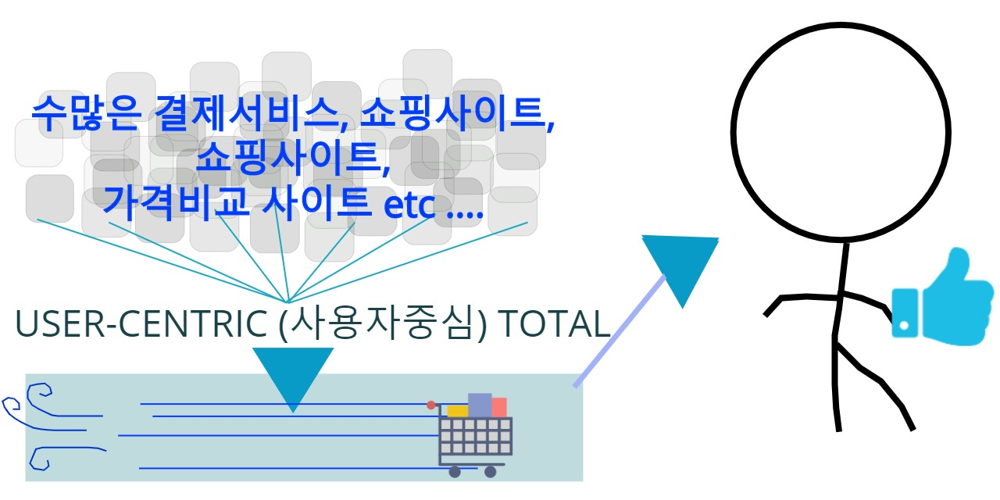
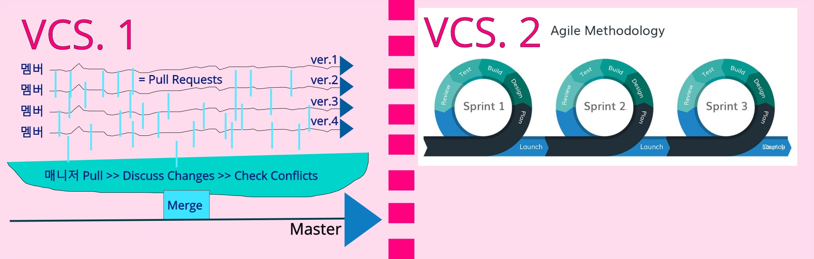

# LAZY-CART

> <<<<---img src="totalShoppingExp.jpg">
>LazyCart (레이지카트)는 <b>소비자중심</b>의 "YongHunDotCom-licensed 오픈소스 웹-서비스"입니다.  레이지카트는 전적으로 감사하는 후원자님들과 테크니컬-파트너분들의 지속적인 참여를 통해 운영되는 서비스입니다.

저희 LazyCart와 함께하고 싶으시다면: 

<ul>
	<li><a href="mailto:beanskobe@gmail.com">후원을 통한 참여</a></li>
	<li><a href="mailto:beanskobe@gmail.com">기술적 참여</a></li>

</ul>

## Table of contents

* [서비스 설명](#서비스-설명)
* [시연](#시연)
* [컨셉트](#컨셉트)
* [요구사항분석](#요구사항분석)
* [데이터베이스](#데이터베이스)
* [프로젝트 구조와 패턴](#서비스-구조와-패턴)
* [인터페이스와 기능](#인터페이스와-기능)
* [팀워크플로우](#팀워크)
* [팀소개](#팀소개)

## 서비스 설명

### 서비스 정의 / 서비스 목적
### 서비스 목적
### 팀소개
### Dependencies

| 라이브러리 | 경로 | 버전| 용도|
|---------|--------|-------|-------------|
| Apache Tomcat | 로컬 | 8.5.55 | 웹 프레임워크 |
|Java EE | 로컬| 8 | 서버사이드 언어 / DB 커넥션 |
|MySQL | 로컬 | 8.0 | 데이터베이스 |
|Eclipse Photon | 개인 | 4.8 | 통합 IDE |
| Jsoup  | .jar | 1.13.1 | ??????? |
| JSTL  | .jar | ???? | ??????? |
| Standard  | .jar | ???? | ??????? |
| Commons-io  | .jar | 2.7 | ??????? |
| Commons-Fileload  | .jar | 1.4 | ??????? |
| Jquery  | CDN | 3.5.1 / 1.12.4 / 1.12.1 | ??????? |
| (구글) analytics.js  | CDN | 1.2.1 | ???? |
| Chart.js  | CDN | 2.7.1 / 2.9.3 | ???? |
| Util.js  | CDN | ? | ???? |
| (다음) postcode.v2.js  | CDN | ? | ???? |
| popper.js  | CDN | 1.16.0 | ???? |
| Bootstrap  | CDN | 4.5.0 | ???? |

## 컨셉(Topic) : 

### 주제 소개

::: 여러 쇼핑몰에서 살펴본 상품들의 정보를 하나의 장바구니에 담아 상품을 조회, 비교, 구매할 수 있는 프로그램입니다. 기존에는 장바구니 기능은 개별 홈페이지의 상품만 담을 수 있는 반면, LazyCart는 쇼핑몰 페이지 도메인과 무관하게 상품을 담을 수 있어 유저가 보다 편리하게 온라인 쇼핑할 수 있습니다.

### 컨셉

::: EasyBasket은 "편리한 온라인 쇼핑을 돕는 장바구니 프로그램"이라는 취지로
	1) 기능적인 측면에서 Chrome Extension을 사용하여 현재 상품 페이지 탭에서 탭 이동 없이 장바구니를 사용할 수 있습니다.
	2) 화면 구성 또한 단순한 구성과 색상으로 Assistance Program으로써 기능적인 면에 보다 충실하고자 합니다.
	
## 유저 중심의 기능 분석

::: 익스텐션과 웹은 서로 연동되어 있으면서도 각각에 맞는 기능과 UI를 구상했습니다.
익스텐션은 장바구니 담기와 상품 조회 목적에 최소화하며 화면 또한 단순화 하여 쇼핑에 집중할 수 있도록 합니다.
웹은 필터링/검색/Analysis 등 추가적 기능을 포함하며 특히, 장바구니 상품을 가격, 쇼핑몰, 카테고리 등 기준으로 비교할 수 있습니다.
	1. 각자 그린 프로토 타입
	2. 기능 정리
	
## 서비스 구조와 패턴
	1. 구조 (폴더 구조보여주기)
	<!-- image 삽입 -->
	2. 패턴 (다이어그램)
	<!-- image 삽입 -->
	
## 데이터베이스
데이터베이스+DAO설명?
## 주요 기능 소개
<!-- 전체 기능 분류한 장표 이미지로 삽입 -->
	정렬/필터 기능 - 알고리즘
	<!-- image 삽입 -->
	Analysis - Chart.JS 라이브러리
	<!-- image 삽입 -->
	Extension - iframe, 현재 탭 url 긁어오는 기능 등
	크롬 익스텐션
::: 크롬익스텐션  
파일 정보:  
 manifest.json : 
  익스텐션의 기본적인 정보를 등록한다. 이름, 아이콘, 기본 팝업창, background script, content script, 어떤 사이트에서 스크립트가 사용될지 등등   
 background.js : 
  크롬 익스텐션 전반에서 이벤트 발생시 특정한 기능을 처리한다. 페이지 이동, 익스텐션 설치, 텝 닫힘 등을 감지할 수 있다. 이번 익스텐션에서는 메시지 리스너를 추가해 콘텐츠 스크립트에서 전달된 메세지에 따라 로그인 배너를 아이콘 위에 표시해주도록 했다.  
 content.js : 
  manifest 파일에 content.js가 페이지가 http://localhost:8888/에 포함된 경우 호출되도록 match시켜놨다. 현재 크롬익스텐션은 모두 iframe 기반으로, 서버에서 받은 데이터를 iframe 내부에 호출한다. 웹 보안 정책인 same origin policy는 불러온 스크립트가 호스트가 다른 경우, 보안을 위해 접근을 제한한다. 따라서 content.js가 iframe 내부에서 호출되어 데이터를 받아오는 작업이 필수적이다. 현재 프로그램에서 content.js는 background script와 iframe을 호출하는 모든 페이지와 메세지를 주고받는다. content.js는 로그인 여부, 작업 성공여부를 검사한다.  
 나머지 html 확장자: 
  모든 html파일은 별개로 각자의 js파일을 가진다. js파일에는 기본적인 javascript 함수들과 chrome.extension API 기능을 사용한 함수들을 등록한다.  

 동작 순서 : 
1. content script 가 로그인 여부를 검사한다. 사이트에 접속하거나 익스텐션 아이콘을 누르면 호출된다.
2. background script가 content script에서 전달된 메세지를 받는다. 배너가 로그인 여부에 따라 ON/OFF로 바뀐다.
3. popup.html이 content script에서 전달된 메세지를 받는다. 로그인 여부에 따라 메뉴가 로그인/로그아웃으로 바뀐다.
4. popup.html에 메뉴를 클릭하면 각각의 기능이 동작한다. iframe이 호출된 경우, 정보는 모두 서버로 전달되고 저장된다. 

	<!-- image 삽입 -->
	Crawling - Jsoup라이브러리, url Parsing
	
	
## 협업방식
#### 1. 업무 일지,
  - 팀원끼리 번갈아가며 업무일지 회의록 작성함으로써 팀원 모두 업무 현황을 공유.
  - 매일 회의에서 팀 및 개인적 차원에서 오늘/내일 할 일들을 정리.
#### 2. 간트차트
간트차트로 업무 진척도 파악
<!-- image 삽입 -->

#### 3. Slack
  - 메신저
  - 깃헙 연동 알람 (Repository Subscription)

#### 4. Version Control System (Github)
1. 각자 편한 Github 프로그램 사용  
1.1. master pull >  work > new branch > pull request  
1.2. master pull > work > updated master pull & merge > test > push master  

## 팀소개

| Lee, Chi Jong | Im, Chae Eun | Cho, Yong Hun | Kim, Joo Hyuk |
| :---: | :---: | :---: | :---: |
| Seoul,Korea | Theater,Cafe,Gallery | Seoul,Korea | Jeju, Philppines, Seoul |
| Project Leader | Full-ops Manager | Dev-ops Manager | Developing Surfer | 
|||||
|    |    |    |    |

